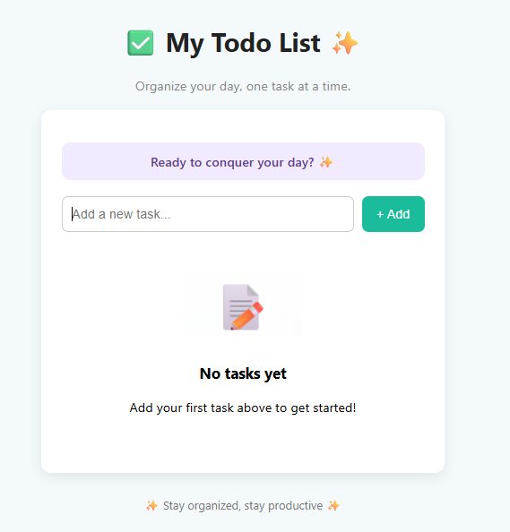
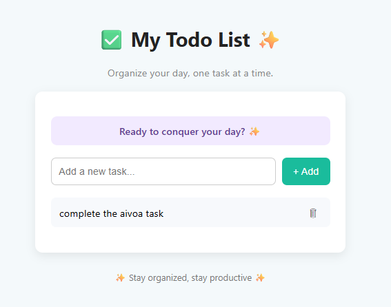
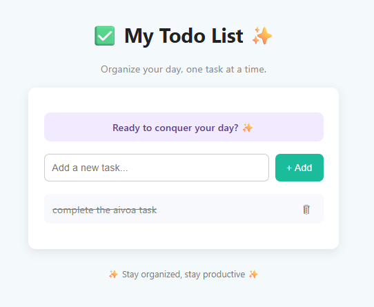

📄 My Todo List App 

1. Overview

🔹The My Todo List application is a simple yet powerful task management tool built using React.js.

🔹It allows users to create, manage, and track daily tasks in a clean, user-friendly interface.

🔹The app encourages productivity with positive, motivational microcopy and smooth interactions.

3. Features
   
♦Add New Tasks – Users can type a task in the input field and add it to the list with a single click.

♦Delete Tasks – Unwanted tasks can be removed instantly using the trash icon.

♦Mark as Completed – Clicking on a task toggles its completion state (with strikethrough text).

♦Motivational Prompts – Displays text like “Ready to conquer your day? ✨” to inspire the user.

♦Responsive UI – Works well on different devices, keeping layout clean and centered.

3. User Interface Flow

📸Screenshot 1 – Empty State

● The app is launched with no tasks.

● Displays a header: "✅ My Todo List ✨" with a tagline "Organize your day, one task at a time."

● Shows a friendly input box to add tasks and a green “+ Add” button.

● Empty state graphic with text "No tasks yet – Add your first task above to get started!"

📸Screenshot 2 – Task Added

● User adds the task: "complete the aivoa task".

● The task appears below the input box with a delete (🗑️) button.

● The motivational message remains at the top.

● Clean white card background for tasks for better readability.

📸Screenshot 3 – Task Marked as Completed

● User clicks on the task, and it gets a strikethrough effect, showing it’s completed.

● The completed task remains in the list until deleted.

● UI remains minimal and intuitive, keeping focus on the tasks.

4. Technical Details

🔸Frontend Framework: React.js

🔸Styling: CSS for layout, spacing, and animations.

5.Components:

🔸Header Component – App title & motivational text.

🔸TaskInput Component – Input field and Add button.

🔸TaskList Component – Displays list of tasks with delete and toggle completion features.

🔸State Management: React useState hook for handling task data.

🚀 How to Use

This project was bootstrapped with [Create React App](https://github.com/facebook/create-react-app).

In the project directory, you can run: npm start

Runs the app in the development mode.\
Open [http://localhost:3000](http://localhost:3000) to view it in your browser.

